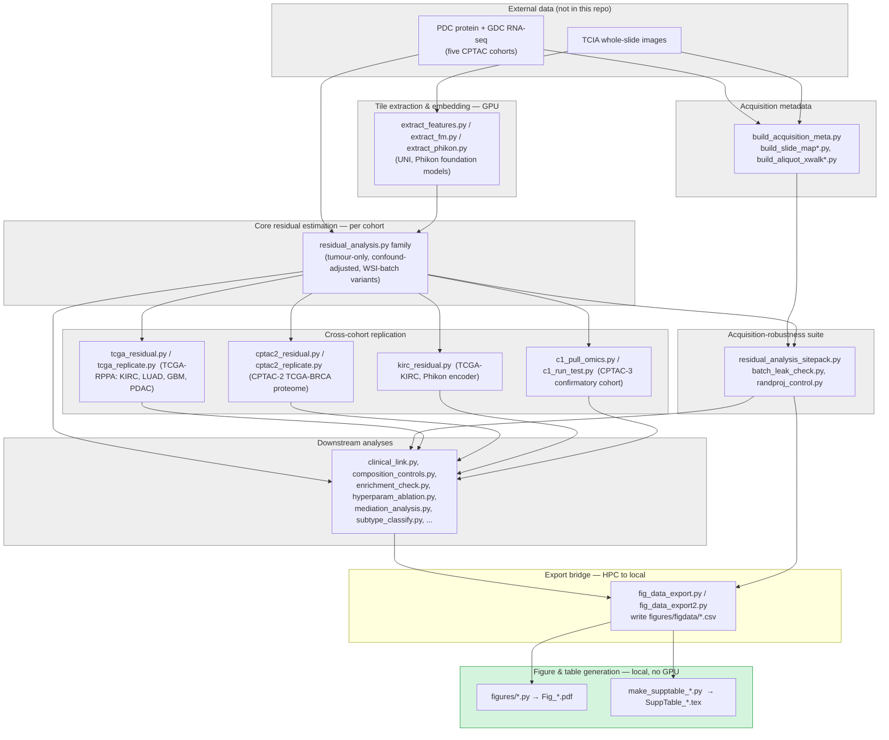

# MorphoResidual

Analysis code for a study of whether tumour H&E morphology predicts protein
abundance beyond what is explained by a gene's own mRNA, evaluated across
five CPTAC cancer cohorts (CCRCC, LUAD, UCEC, GBM, PDAC) with replication
attempts in independent TCGA/CPTAC-3 cohorts.

Manuscript: submitted to *Nature Communications*; a citation and DOI will be
added here on publication.

**Contents:** [Reproducibility status](#reproducibility-status-read-this-first) ·
[Pipeline overview](#pipeline-overview) ·
[How to reproduce a result](#how-to-reproduce-a-result) ·
[Repository layout](#repository-layout) ·
[Which script makes which display item](#which-script-makes-which-published-display-item) ·
[Data](#data) · [Requirements](#requirements) · [License](#license)

## Reproducibility status (read this first)

This is the actual pipeline code, not a cleaned-up reference reimplementation,
and it is **not click-to-run outside the source HPC environment**. Concretely:

- The `server_export/scripts/` and top-level `*.py` scripts were run against
  restricted-access CPTAC/TCGA/GDC data on the source institution's HPC
  cluster. Getting a given number to reproduce requires (a) obtaining that
  data yourself under the terms in the manuscript's Data availability
  statement, (b) installing `requirements.txt`, and (c) pointing each script
  at your own data layout via the environment variables documented in its
  header (most commonly `MORPHO_SIG_CSV`, `MORPHO_OUT`, `MORPHO_WSI_EMB_DIR`,
  `MORPHO_COHORT` and `MORPHO_ROOT`; grep a script's docstring for the full
  list it uses). Several scripts still default to the source institution's
  absolute path (`/public/home/fjhui/ZW`) when a variable is unset — that
  default will not resolve on another machine and is not meant to.
- The `figures/*.py` scripts are the easiest entry point, and the only tier
  below that is realistically runnable on a laptop today: each is a
  self-contained matplotlib script that reads a small, already-computed
  table and writes one published figure, printing the exact statistic it
  plotted to stdout. No GPU or restricted data is needed to *read* them, only
  to *run* them, and only once the corresponding data table is in hand (see
  [How to reproduce a result](#how-to-reproduce-a-result) below).
- Exact package version pins used for the reported analyses are not yet
  captured in this repository (see the manuscript's Limitations); versions in
  `requirements.txt` are unpinned.

## Pipeline overview

Stage names below are the actual script names; grouping (not every script) is
shown for readability. Grey stages need restricted CPTAC/TCGA data and, for
tile embedding, a GPU; the green stage is the one runnable from just this
repository plus a small derived table.



`fig_data_export.py`/`fig_data_export2.py` are the literal bridge: run once
on the source HPC, their output directory is copied to a local
`figures/figdata/` (their own docstrings say so — "Then WinSCP the whole
.../figdata/ folder to your local machine"). That directory, plus a handful
of `server_export/results/*.csv` files the figure scripts read directly, is
what will ship as the manuscript's Supplementary Data.

## How to reproduce a result

Three tiers, from "runs on a laptop today" to "needs the source HPC and
restricted-access data":

### Tier 1 — Regenerate a figure from a derived data table

This is the realistic entry point for a reviewer. Once you have the relevant
`figures/figdata/*.csv` / `server_export/results/*.csv` files (from the
manuscript's Supplementary Data, or because you produced them yourself via
Tier 3), figure scripts need no arguments and no environment variables —
they use paths relative to the `figures/` directory:

```bash
git clone https://github.com/tiandaochouqin-Wei/MorphoResidual.git
cd MorphoResidual
python -m venv .venv && source .venv/bin/activate   # or your usual env manager
pip install -r requirements.txt

# drop the Supplementary Data tables into figures/figdata/ (and
# server_export/{results,pinned}/ where a script reads those directly —
# check the script's DD/ROOT path constants near the top if unsure)

cd figures
python make_fig_clinical.py
```

Expected output (this is the actual line the script prints, so you can diff
it directly against the manuscript's reported statistic):

```
wrote Fig_clinical | KM log-rank P=0.031, n=98
```

and `Fig_clinical.{svg,pdf,png,tiff}` are written into `figures/`. Every
figure script in the [mapping table](#which-script-makes-which-published-display-item)
below follows this same pattern — `cd figures && python <script>.py` — and
prints a one-line summary of the number(s) it just plotted, specifically so
a reviewer can check the number without opening the PDF.

### Tier 2 — Regenerate a supplementary table

Same pattern, from the repository root instead of `figures/`, e.g.:

```bash
python make_supptable_nuisance.py   # writes SuppTable_nuisance.tex
```

### Tier 3 — Re-run the pipeline stage that produced a table, from raw data

This needs (i) CPTAC/TCGA/GDC access under their own data-use terms — see
[Data](#data) — and (ii) for tile embedding specifically, a GPU node. Follow
the [pipeline overview](#pipeline-overview) top to bottom; each stage's own
script docstring documents its exact inputs, outputs and environment
variables (search for `Run:` or `os.environ.get(` near the top of the file).
In outline, for one cohort:

1. Download that cohort's PDC protein table, GDC RNA-seq counts and TCIA
   whole-slide images (accessions in the manuscript's Data availability
   statement).
2. Extract tile embeddings with `extract_fm.py` (UNI) or `extract_phikon.py`
   (Phikon) — GPU node, writes one `.pt` file per slide.
3. Build the acquisition-metadata census (`build_acquisition_meta.py`,
   `build_slide_map*.py`) from the same slide headers.
4. Run the core estimator (`residual_analysis.py`, pointed at that cohort via
   `MORPHO_ROOT`/`MORPHO_WSI_EMB_DIR`/etc.) to get per-gene incremental $R^2$
   and permutation $p$-values.
5. Run the acquisition-robustness pack (`residual_analysis_sitepack.py`) for
   the batch-stratified permutation null and batch-grouped cross-validation.
6. For the relevant replication cohort, run the matching script in
   `tcga_residual.py`/`tcga_replicate.py` (TCGA-RPPA), `kirc_residual.py`
   (TCGA-KIRC), `cptac2_residual.py`/`cptac2_replicate.py` (CPTAC-2
   TCGA-BRCA) or `c1_pull_omics.py`/`c1_run_test.py` (CPTAC-3 confirmatory).
7. Run whichever downstream analysis script matches the result of interest
   (clinical association, composition control, enrichment, ablation, ...);
   each is referenced by filename at the relevant point in the manuscript's
   Methods.
8. Export the tables the figures need with `fig_data_export.py` /
   `fig_data_export2.py`, copy the output to a local `figures/figdata/`, and
   proceed as in Tier 1.

This tier is not a single command, and is not meant to be: it mirrors how
the analysis was actually run, one HPC batch job per stage, over several
weeks. A reviewer who wants to check a specific number is generally better
served by Tier 1 or 2 plus reading the one script named in the
[mapping table](#which-script-makes-which-published-display-item) or in the
Methods text, rather than re-running the full pipeline end to end.

## Repository layout

```
MorphoResidual/
├── figures/                    one script per figure/table (see mapping below)
│   ├── make_master_composite.py       → Fig_master.pdf         (Fig. 1)
│   ├── make_fig_controls.py           → Fig_controls.pdf       (Fig. 2)
│   ├── ...                            (11 more live figure scripts)
│   ├── mrstyle.py                     shared plotting style, imported everywhere
│   └── (~20 earlier drafts, not referenced by the current manuscript —
│        see "Which script makes which published display item" below)
│
├── server_export/scripts/      HPC pipeline: embeddings → residual estimation
│   ├── extract_fm.py, extract_phikon.py        tile embedding (GPU)
│   ├── build_acquisition_meta.py, build_slide_map*.py    acquisition metadata
│   ├── residual_analysis*.py                   core estimator + variants
│   └── ... (batch robustness, download/setup utilities, LSF job scripts)
│
├── *.py (repository root)      cohort-level analyses referenced by filename
│   ├── clinical_link.py, composition_controls.py, ...   downstream analyses
│   ├── tcga_*.py, cptac2_*.py, kirc_residual.py          external replication
│   ├── fig_data_export.py, fig_data_export2.py           HPC → figdata bridge
│   └── make_supptable_*.py                               Supplementary Tables
│
├── requirements.txt
├── LICENSE                     MIT (code only, not third-party model weights)
└── README.md
```

## Which script makes which published display item

The 13 figures actually embedded in the current manuscript, and the script
that produces each one:

| Manuscript figure | Script | Output |
|---|---|---|
| Fig. 1 (flagship discovery) | `figures/make_master_composite.py` | `Fig_master.pdf` |
| Fig. 2 (capacity/composition controls) | `figures/make_fig_controls.py` | `Fig_controls.pdf` |
| Fig. 3 (biology vignettes) | `figures/make_fig_biology.py` | `Fig_biology.pdf` |
| Fig. 4 (robustness composite) | `figures/make_composite2.py` | `Fig_master2.pdf` |
| Fig. 5 (clinical) | `figures/make_fig_clinical.py` | `Fig_clinical.pdf` |
| Fig. 6 (mechanism) | `figures/make_fig_mechanism.py` | `Fig_mechanism.pdf` |
| Methods pipeline diagram | `figures/make_fig_methods_pipeline.py` | `Fig_methods_pipeline.pdf` |
| Supp. Fig. (reproducibility) | `figures/make_fig_supp1.py` | `Fig_supp1_reproducibility.pdf` |
| Supp. Fig. (scores) | `figures/make_fig_supp2.py` | `Fig_supp2_scores.pdf` |
| Supp. Fig. (mTOR) | `figures/mtor_mechanism.py` | `Fig_mtor.pdf` |
| Supp. Fig. (pan-organ core) | `figures/make_fig_pan_organ_core.py` | `Fig_pan_organ_core.pdf` |
| Supp. Fig. (replication) | `figures/make_fig_replication.py` | `Fig_replication.pdf` |
| Supp. Fig. (WSI spatial) | `figures/make_fig_wsi_spatial_supp.py` | `Fig_wsi_spatial_supp.pdf` |

Some supplementary tables are produced by a matching `make_supptable_*.py`
script in the repository root (e.g. `make_supptable_nuisance.py` →
`SuppTable_nuisance.tex`); others, including the two main-text tables (atlas
and enrichment survival), are compiled by hand from the underlying result
files rather than by a dedicated script.

`figures/` contains roughly twenty additional `make_*`/plotting scripts
(e.g. `make_fig1.py`, `make_figs.py`, `make_realdata_figs*.py`,
`make_txome_fig.py`) that are **earlier drafts of these same figures, kept
for provenance and not referenced by the current manuscript** — several
carry an explicit `# superseded by ...` note. If a script's output filename
does not appear in the table above, it is not currently live; check the
table, not the script list, to find the source of a specific published
number.

## Data

No data is redistributed here. The five discovery cohorts and their
Proteomic Data Commons study identifiers: CCRCC (PDC000127), LUAD
(PDC000153), UCEC (PDC000125), GBM (PDC000204), PDAC (PDC000270); matched
RNA-seq is from the Genomic Data Commons and H&E whole-slide images from the
corresponding TCIA *CPTAC Pathology Discovery Cohort* collections. Full
accessions, release dates and replication-cohort sources (TCGA-RPPA,
CPTAC-2 TCGA-BRCA, CPTAC-3 confirmatory cohorts) are listed in the
manuscript's Data availability statement.

## Requirements

`requirements.txt` lists the third-party packages imported across this
repository (collected by scanning every committed script; versions
unpinned, see [Reproducibility status](#reproducibility-status-read-this-first)
above). Random seeds, cross-validation splits and foundation-model encoder
weights used are documented in the manuscript's Methods ("Software,
versions, seeds and encoder weights"). Third-party model weights (UNI,
Phikon, Phikon-v2) are not redistributed here and remain subject to their
own providers' licences.

## License

MIT — see [LICENSE](LICENSE). This licence covers the code in this
repository only; it does not extend to third-party model weights it loads.
